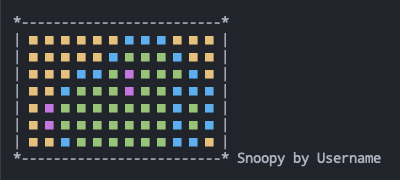
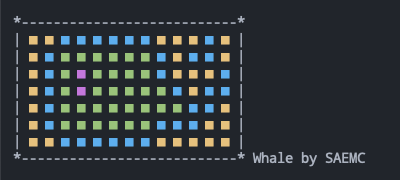

# Commit Automator

This is a Commit Automator which checks number of commits needed, and then commits & pushes it into your Github automatically. Also this displays how your art will look in the GitHub contribution count.

---

## Prerequisites

### Requirements

- Git and Github account
- Python with Conda environment
- Cron

### Set directories

```shell
# Assume that you are in $HOME like '/home/you/'
# So you run these commands, then you will be in '/home/you/Automator/'
mkdir Automator && cd Automator/


# Clone this repository
git clone https://github.com/SAEMC/Commit-Automator.git


# Create a directory for new repository
mkdir Auto-Commit && cd Auto-Commit/


# Notice that you've already had to create
# new remote repository in Github first
# (Enter your Github username below)
echo "# Auto-Commit" >> README.md
git init
git add README.md
git commit -m "first commit"
git branch -M main
git remote add origin https://github.com/YourGithubUsername/Auto-Commit.git
git push -u origin main


# You must be in '/home/you/Automator/'
cd ..
```

```
# Now structure looks like:
Automator <- You are here
├── Auto-Commit
│   └── README.md
└── Commit-Automator
    ├── LICENSE.txt
    ├── README.md
    ├── assets
    │   ├── Snoopy.png
    │   └── Whale.png
    ├── commit-automator
    │   ├── __init__.py
    │   ├── __main__.py
    │   ├── __version__.py
    │   ├── actions.py
    │   ├── calculator.py
    │   ├── committer.py
    │   ├── dataloader.py
    │   ├── logger.py
    │   ├── main.py
    │   └── painter.py
    ├── examples
    │   ├── art.json.example
    │   └── cron.sh.example
    └── requirements.yml
```

### Create a Conda environment with requirements

```shell
# Create and activate a Conda env
# The name of env name is 'automator' by default,
# but you can change the name to whatever you want to
conda env create --file requirements.yml && \
conda activate automator


# You can check the path of Python runtime
# The path shown after running this command is used when you set Cron
(automator) which python
```

<br/>

## Usages

### Handle `art.json`

```shell
# Copy or move 'Commit-Automator/examples/art.json.example'
# to 'Commit-Automator/art.json'
cp Commit-Automator/examples/art.json.exmaple Commit-Automator/art.json
```

```
# In 'art.json'

# Now you can change the values:
# 1. 'user_name' must be your Github username
# 2. 'art_name' is name of art
#    I've set 'Snoopy' for example
# 3. 'start_date' must start from Sunday
# 4. 'duration' is a cycle(periods) of painting your art
#    'duration' and length of 'pixels_level' must be same
# 5. 'pixels_level' is color depth from 0 to 4
#    You can see contirbution count color in Github profile page
#    I've set 'Snoopy' for example

{
  "user_name": "Username",
  "art_name": "Snoopy",
  "start_date": "2023-01-01",
  "duration": 12,
  "pixels_level": [
    [1, 1, 1, 1, 1, 1, 1],
    [1, 1, 1, 1, 4, 4, 1],
    [1, 1, 1, 3, 2, 2, 3],
    [1, 1, 3, 2, 2, 2, 2],
    [1, 1, 3, 2, 2, 2, 2],
    [1, 3, 2, 2, 2, 2, 2],
    [3, 2, 4, 4, 2, 2, 2],
    [3, 2, 2, 2, 2, 2, 2],
    [3, 2, 2, 2, 2, 2, 2],
    [1, 3, 2, 3, 3, 3, 3],
    [1, 1, 3, 3, 2, 2, 3],
    [1, 1, 1, 3, 3, 3, 1]
  ]
}

# '0' is Bright White
# '1' is Bright Yellow
# '2' is Bright Green
# '3' is Bright Blue
# '4' is Bright Magenta
# So this 'art.json' shows Snoopy like below,
# and in my case, it shows Whale:
```

<p align="center">
  
  
</p>

### How to use Commit-Automator

```shell
# This is default command
python Commit-Automator/commit-automator -f FilenameOfArt [-x {commit,display}] [-l]


# You'd better check helps
python Commit-Automator/commit-automator -h
```

### How to use Commit-Automator with `commit`

#### 1. Manually

```shell
# 'githubAccessToken' has had to be already set in environment variables
(automator) export githubAccessToken="YourGithubAccessToken"


# You must be in new repository
(automator) cd Auto-Commit/


# Filename of art is 'art.json' here, but you can change it
# Saving log file is 'True' here, but you can change it
(automator) python ../Commit-Automator/commit-automator -f art.json -l
```

#### 2. Automatically

```shell
# Copy or move 'Commit-Automator/examples/cron.sh.example'
# to 'Commit-Automator/cron.sh'
cp Commit-Automator/examples/cron.sh.exmaple Commit-Automator/cron.sh
```

```shell
# In 'cron.sh'

# Whenever the paths are changed,
# you just modify this script without running Cron restart command


...


# You have to change these in the following lines:
# 1. Directory of new repository
# 2. Path of Python runtime
# 3. Path of commit-automator package
# 4. Filename of art is 'art.json' here, but you can change it
# 5. Saving log file is 'True' here, but you can change it

cd /home/you/Automator/Auto-Commit/ && \                   # 1
  /the/path/shown/after/running/which/python \                 # 2
  /home/you/Automator/Commit-Automator/commit-automator \  # 3
  -f art.json -l                                           # 4, 5
```

```
# In the Crontab editor (via '$ crontab -e')

# When you get the schedule and path of 'cron.sh' fixed once,
# you might never worry about the changes of
# paths of the directory of new repository, Python runtime, etc.
# So I love this way

...


# 'githubAccessToken' has had to be already set in environment variables
githubAccessToken="YourGithubAccessToken"


# You have to change this schedule
# For example, '59 23 * * *' or '1 0 * * *'
# And have to change the path of 'cron.sh'
* * * * * /home/you/Automator/Commit-Automator/cron.sh
```

```shell
# And then run this command
service cron restart


# Additionally, you can check the status of Cron
service cron status
```

### How to use Commit-Automator with `display`

```shell
# Assume that you are in '/home/you/Automator/'
# Filename of art is 'art.json' here, but you can change it
python Commit-Automator/commit-automator -f art.json -x display
```
